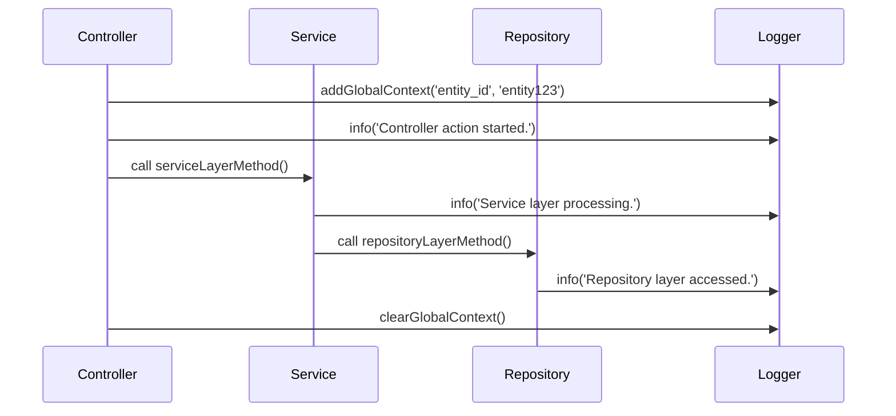

# MDCLogger

## Overview

MDCLogger is a PHP library that provides logging capabilities based on Mapped Diagnostic Context (MDC). It extends the PSR-3 LoggerInterface and allows you to add global context to your log messages.

## Installation

To install MDCLogger, use Composer:

```bash
composer require gabrielanhaia/mdc-logger
```

## Requirements

- `PHP 7.4` or higher
- `psr/log` ^3.0

## What is MDC Context?

MDC (Mapped Diagnostic Context) allows you to add context information to your log messages. This is useful for tracking information across different parts of your application, such as user sessions, request IDs, or any other data that you need to correlate across log entries.

## How to Use MDCLogger in PHP

### Setup

1. **Autowiring with Symfony**

   If you are using Symfony with autowiring, the `MDCLoggerInterface` will be automatically injected into your services. Ensure you have configured your service container correctly.

2. **Manual Setup**

   If you are not using a framework that supports autowiring, you need to set up the `MDCLogger` manually. You must also configure the `LoggerInterface` with your actual logger, such as Monolog.

### Example Usage

#### Creating the Logger

```php
use Monolog\Logger;
use Monolog\Handler\StreamHandler;
use MDCLogger\MDCLogger;
use MDCLogger\MDCLoggerInterface;

// Create a Monolog logger instance
$monolog = new Logger('app');
$monolog->pushHandler(new StreamHandler('path/to/your.log', Logger::DEBUG));

// Wrap the Monolog logger with MDCLogger
$mdcLogger = new MDCLogger($monolog);
```

#### Adding Global Context

```php
$mdcLogger->addGlobalContext('user_id', '12345');
$mdcLogger->addGlobalContext('request_id', 'abcde');
```

#### Logging Messages

```php
$mdcLogger->info('User logged in.');
$mdcLogger->error('An error occurred.', ['exception' => $exception]);
```

#### Clearing Global Context

```php
$mdcLogger->clearGlobalContext();
```

### Complete Example

```php
<?php

require 'vendor/autoload.php';

use Monolog\Logger;
use Monolog\Handler\StreamHandler;
use MDCLogger\MDCLogger;
use MDCLogger\MDCLoggerInterface;

// Create a Monolog logger instance
$monolog = new Logger('app');
$monolog->pushHandler(new StreamHandler('path/to/your.log', Logger::DEBUG));

// Wrap the Monolog logger with MDCLogger
$mdcLogger = new MDCLogger($monolog);

// Adding global context
$mdcLogger->addGlobalContext('user_id', '12345');
$mdcLogger->addGlobalContext('request_id', 'abcde');

// Logging messages
$mdcLogger->info('User logged in.');
$mdcLogger->error('An error occurred.', ['exception' => $exception]);

// Clearing global context
$mdcLogger->clearGlobalContext();
```

### Using Singleton with Auto-injection

To ensure the MDC context is available across different layers of your application, you should use a singleton instance of `MDCLogger`. This instance can be auto-injected throughout your application, allowing you to add context and log messages from various points.

```php
<?php

namespace App\Controller;

use MDCLogger\MDCLoggerInterface;
use Symfony\Bundle\FrameworkBundle\Controller\AbstractController;
use Symfony\Component\HttpFoundation\Response;

class SampleController extends AbstractController
{
    private MDCLoggerInterface $mdcLogger;

    public function __construct(MDCLoggerInterface $mdcLogger)
    {
        $this->mdcLogger = $mdcLogger;
    }

    public function sampleAction(): Response
    {
        // Add context at the controller level
        $this->mdcLogger->addGlobalContext('entity_id', 'entity123');

        // Log in the controller
        $this->mdcLogger->info('Controller action started.');

        // Call service layer
        $this->serviceLayerMethod();

        // Clear context at the end
        $this->mdcLogger->clearGlobalContext();

        return new Response('Action completed');
    }

    private function serviceLayerMethod(): void
    {
        // Log in the service layer
        $this->mdcLogger->info('Service layer processing.');

        // Call repository layer
        $this->repositoryLayerMethod();
    }

    private function repositoryLayerMethod(): void
    {
        // Log in the repository layer
        $this->mdcLogger->info('Repository layer accessed.');
    }
}
```

### Example Log Output

When using MDCLogger with multiple global contexts, the log output will include the global context and any additional context provided at the log message level. Here is an example of how a log entry might look in JSON format:

```json
{
  "message": "An error occurred.",
  "context": {
    "mdc_context": {
      "user_id": "12345",
      "request_id": "abcde",
      "entity_id": "entity123"
    },
    "local_context": {
      "additional_info": "Some local context data"
    }
  },
  "level": "error",
  "channel": "app",
  "datetime": "2024-07-13T12:00:00+00:00",
  "extra": []
}
```

This output shows the following:

- **message**: The log message.
- **context**: The combined context information.
    - **mdc_context**: The global context, including `user_id`, `request_id`, and `entity_id` (you can add multiple global contexts that are shared across log entries)
    - **local_context**: Additional context specific to this log entry.
- **level**: The log level (e.g., error, info).
- **channel**: The logging channel (e.g., app).
- **datetime**: The timestamp of the log entry.
- **extra**: Any additional metadata (empty in this case).

### Diagram

Below is a diagram showing the flow of adding global context in a controller, logging in different layers, and clearing the context at the end.



## Interface

### MDCLoggerInterface

The `MDCLoggerInterface` extends the `LoggerInterface` from PSR-3 and adds methods to manage the global context.

```php
namespace MDCLogger;

use Psr\Log\LoggerInterface;

interface MDCLoggerInterface extends LoggerInterface
{
    public function addGlobalContext(string $key, string $value): void;
    public function getGlobalContext(): array;
    public function clearGlobalContext(): void;
}
```

## License

This project is licensed under the MIT License. See the [LICENSE](LICENSE) file for details.

## Author

Gabriel Anhaia  
[Email](mailto:ga.contact.me@gmail.com)
